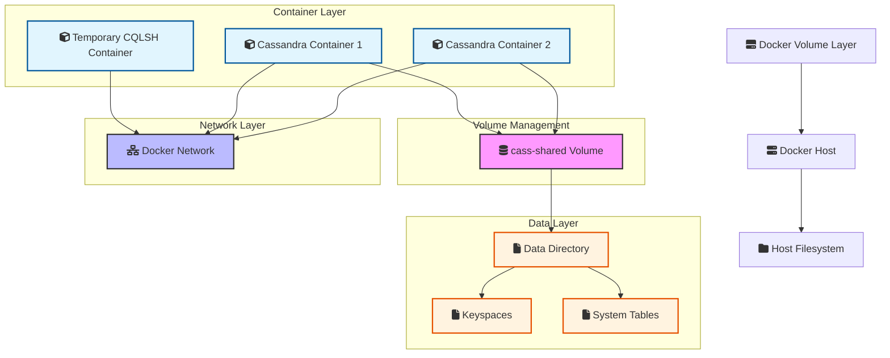

# 🚀 Docker Volume Management with Cassandra

[](https://github.com/TheToriqul/docker-volumes)
[](https://github.com/TheToriqul/docker-volumes/stargazers)


## 📋 Overview

This project demonstrates my understanding of Docker volume management and data persistence using Apache Cassandra. Through hands-on implementation, I've explored how to effectively manage persistent data in containerized environments, focusing on database state preservation and container lifecycle management. This project showcases practical solutions for maintaining data persistence in distributed systems.

## 🏗 Technical Architecture

The project implements a data persistence layer using Docker volumes with Apache Cassandra, demonstrating how to maintain database state across container lifecycles.



## 💻 Technical Stack

- **Containerization**: 
- **Database**: 
- **Shell Scripting**: 

## ⭐ Key Features

1. Volume Management
   - Creation and configuration of Docker volumes
   - Volume lifecycle management
   - Data persistence across container restarts

2. Database Operations
   - Cassandra database setup with Docker
   - Data persistence verification
   - Database state management

3. Container Management
   - Container creation with volume mounts
   - Container lifecycle handling
   - Multi-container data sharing

4. Data Persistence
   - Volume backup strategies
   - Data recovery procedures
   - State verification methods

## 📚 Learning Journey

### Technical Mastery:

1. Docker Volume Architecture
2. Container Data Persistence
3. Database State Management
4. Multi-Container Communication
5. Data Backup and Recovery

### Professional Development:

1. Infrastructure Design
2. Documentation Skills
3. Problem-Solving Approach
4. Best Practices Implementation
5. System Architecture Planning

## 🔄 Future Enhancements

<details>
<summary>View Planned Improvements</summary>

1. Multi-node Cassandra cluster setup
2. Automated backup solution
3. Monitoring and alerting system
4. Volume management automation
5. Performance optimization strategies
6. High availability configuration
</details>

## ⚙️ Installation

<details>
<summary>View Installation Details</summary>

### Prerequisites

- Docker Engine
- Docker Compose
- Basic understanding of Cassandra

### Setup Steps

1. Clone the repository:
```bash
git clone https://github.com/TheToriqul/docker-volumes.git
cd docker-volumes
```

2. Create Docker volume:
```bash
docker volume create --driver local --label example=cassandra cass-shared
```

3. Run Cassandra container:
```bash
docker run -d --volume cass-shared:/var/lib/cassandra/data --name cass1 cassandra:2.2
```

</details>

## 📖 Usage Guide

<details>
<summary>View Usage Details</summary>

### Basic Usage

1. Connect to Cassandra:
```bash
docker run -it --rm --link cass1:cass cassandra:2.2 cqlsh cass
```

2. Create and verify keyspace:
```sql
CREATE KEYSPACE docker_hello_world 
WITH replication = {
    'class': 'SimpleStrategy',
    'replication_factor': 1
};
```

### Verification

To verify data persistence:
1. Stop and remove the container
2. Create a new container with the same volume
3. Check if the keyspace exists

</details>

## 📫 Contact

- 📧 Email: toriqul.int@gmail.com
- 📱 Phone: +65 8936 7705, +8801765 939006

## 🔗 Project Links

- [GitHub Repository](https://github.com/TheToriqul/docker-volumes)
- [Docker Volumes Command Reference Guide](./reference-commands.md)

## 👏 Acknowledgments

- [Poridhi for excellent labs](https://poridhi.io/)
- Docker documentation for comprehensive guides
- Apache Cassandra community for database insights
- Container community for best practices

---

Feel free to explore, modify, and build upon this configuration as part of my learning journey. You're also welcome to learn from it, and I wish you the best of luck!