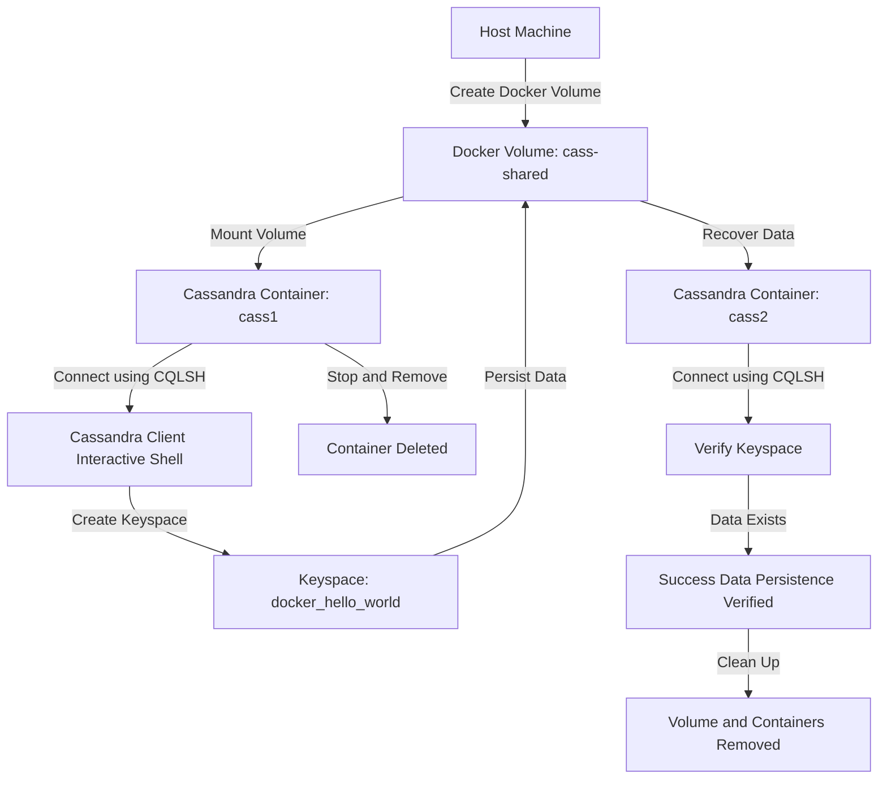

# 🚀 Docker Volumes: Data Persistence in Container Environments

[](https://github.com/TheToriqul/docker-volumes)
[](https://github.com/TheToriqul/docker-volumes/stargazers)


## 📋 Overview

A comprehensive exploration of Docker Volumes focusing on data persistence in containerized environments. This project demonstrates practical implementation of volume management using Apache Cassandra as a real-world example, aimed at DevOps engineers and developers working with containerized applications. This project demonstrates practical implementations of Docker Volumes, with a specific focus on database persistence using Apache Cassandra as an example. Through this work, I've gained hands-on experience with:

- Docker Volume creation and management
- Data persistence strategies
- Container lifecycle management
- Database state preservation
- Volume mounting and configuration
- Container networking and linking

## 🏗 Technical Architecture

The project implements a data persistence layer using Docker volumes with Apache Cassandra as the database system.



## 💻 Technical Stack

- Containerization
- Database
- Shell Scripting

## ⭐ Key Features

1. Volume Management
   - Volume creation and configuration
   - Custom volume drivers
   - Volume lifecycle management

2. Data Persistence   
   - Database state preservation
   - Cross-container data sharing
   - Volume backup and restore

3. Container Integration
   - Multi-container setup
   - Container linking
   - Volume mounting strategies

4. Security Features
   - Volume access control   
   - Data isolation
   - Secure volume sharing

5. Performance Optimization
   - Efficient data access
   - Volume driver optimization
   - Resource management

## 📚 Learning Journey

### Technical Mastery:

1. Docker volume architecture and implementation
2. Data persistence strategies in containerized environments
3. Database state management with volumes
4. Container networking and communication
5. Volume backup and recovery procedures

### Professional Development:

1. Infrastructure design patterns
2. System architecture planning
3. Documentation practices
4. Problem-solving in distributed systems
5. Best practices implementation

## 🔄 Future Enhancements

<details>
<summary>View Planned Improvements</summary>

1. Implementation of custom volume drivers
2. Advanced backup automation
3. Multi-host volume sharing
4. Volume monitoring and metrics
5. Integration with cloud storage providers
6. High availability volume configuration
</details>

## ⚙️ Installation

<details>
<summary>View Installation Details</summary>

### Prerequisites

- Docker Engine 20.10+
- Docker Compose 2.0+
- 4GB+ RAM
- Linux/Unix-based system

### Setup Steps

1. Clone the repository
```bash
git clone https://github.com/TheToriqul/docker-volumes.git
cd docker-volumes
```

2. Create required volumes
```bash
docker volume create --name=cass-shared
```

3. Run Cassandra container
```bash
docker run -d --volume cass-shared:/var/lib/cassandra/data --name cass1 cassandra:2.2
```

</details>

## 📫 Contact

- 📧 Email: toriqul.int@gmail.com
- 📱 Phone: +65 8936 7705, +8801765 939006

## 🔗 Project Links

- [GitHub Repository](https://github.com/TheToriqul/docker-volumes)
- [Documentation](./script-commands.md)

## 👏 Acknowledgments

- [Poridhi for excellent labs](https://poridhi.io/)
- Docker Documentation Team
- Apache Cassandra Community
- Container Solutions Community

---

Feel free to explore, modify, and build upon this configuration as part of my learning journey. You're also welcome to learn from it, and I wish you the best of luck!
